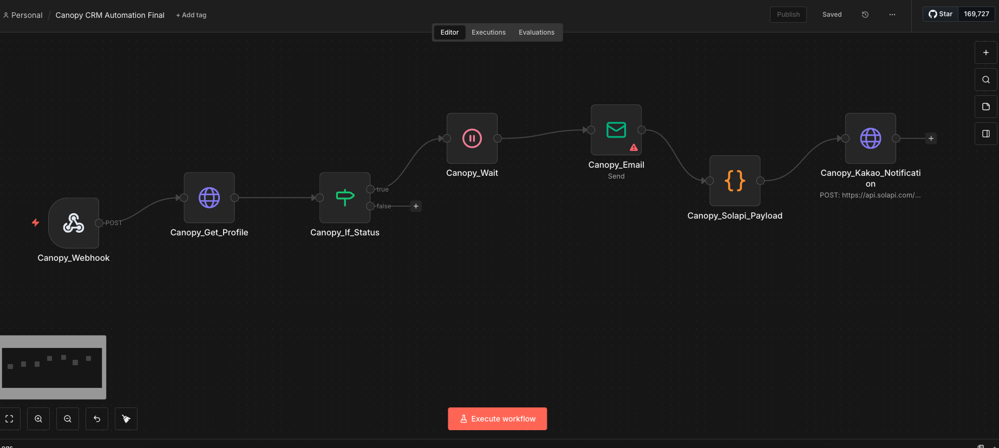

# Canopy Tax CRM + n8n Automation

This project integrates **Canopy Tax CRM** with **n8n** to monitor client profile updates (file uploads or specific field values) and trigger notifications when conditions are met. Due to Public API v3 limitations, the system uses **Custom Field values** to detect changes and includes a **CRM Mock Server** for local development and testing.



## Quick Start

Run the following command in your terminal to start both n8n and the Canopy CRM Mock Server:

```bash
docker compose up --build -d
```

## Directory Structure

- `canopy-crm-mock/`: Canopy CRM Mock Server source code (TypeScript)
- `docs/`: Project documentation and guides
- `specs/`: API specification files
- `workflows/`: n8n workflow templates

## Deployment Recommendation: n8n Cloud (App)

For production stability and ease of management (especially for Gmail OAuth and credential handling), we strongly recommend using the **n8n Cloud (SaaS)** version rather than a self-hosted Docker instance.

- **Stability**: Managed directly by n8n, ensuring 24/7 uptime.
- **Ease of Use**: One-click authentication for Gmail/Google Sheets.
- **Monitoring**: Built-in dashboard to view execution history and manage manual approvals.
- **Maintenance**: No server updates or security patches required.

## Documentation Structure
re: [Documentation Index](./docs/00-index.md)

- [Requirements Summary](./docs/01-requirements.md)
- [Implementation Plan](./docs/02-implementation-plan.md)
- [Status and Flow](./docs/03-status-and-flow.md)
- [Canopy Public API v3 Business Flow](./docs/04-api-business-flow.md)
- [Canopy File Upload Summary](./docs/10-file-upload-guide.md)
- [Canopy File Download Summary](./docs/11-file-download-guide.md)
- [File Upload SOP (Manual Workflow - KR)](./docs/10-file-upload-sop.md)
- [File Upload SOP (Manual Workflow - EN)](./docs/10-file-upload-sop_en.md)
- [Kakao Alimtalk Integration (SOLAPI)](./docs/20-kakao-messaging.md)
- [Canopy API Issue Summary (KR)](./docs/99-canopy-api-issue-summary_kr.md)
- [Canopy API Issue Summary (EN)](./docs/99-canopy-api-issue-summary_en.md)
- [Work Report](./docs/90-report.md)
- [Customer Summary](./docs/95-customer-summary.md)

## Importing n8n Workflow

1. Access n8n at [http://localhost:5678](http://localhost:5678).
2. Create a new workflow.
3. Select **"Import from File"** from the top-right menu.
4. Choose the `workflows/n8n-canopy-workflow.json` file.
5. Configure your credentials (Email, Solapi, etc.) as needed.

## Important Notes

- **API Gap**: Canopy Public API v3 does not currently expose direct file/document endpoints.
- **Trigger Logic**: The "File Existence" check is simulated using **Custom Field** values (e.g., `field_upload_status === 'Uploaded'`).
- **Email-to-Webhook**: The workflow listens to Canopy notification emails via Gmail Trigger and treats them as event signals.
- **Environment Variables**: Make sure to set your Solapi and Email credentials in the `docker-compose.yml` file.
