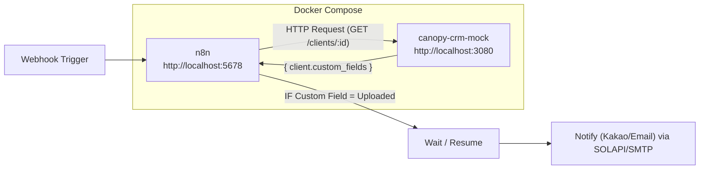

# Status and Flow

## Status summary
- Docker Compose runs n8n + canopy-crm-mock.
- Mock server supports client profile lookups and Custom Field checks.
- The Public API spec has no file/document endpoints, so Custom Field values are used instead.

## Implementation conclusion
- "Profile has a file" cannot be checked directly via the Public API.
- The current implementation uses a Custom Field value as the file-upload indicator.

## Docker services
- n8n: http://localhost:5678
- canopy-crm-mock: http://localhost:3080

## Mock server endpoints
- `GET /public/v3/clients`
- `GET /public/v3/clients/:id`

## High-level flow (Mermaid)

## Items to confirm
- How to detect "file uploaded" in production (file API vs Custom Field)
- Custom Field name/ID and expected value
- Recipient and channel policy
